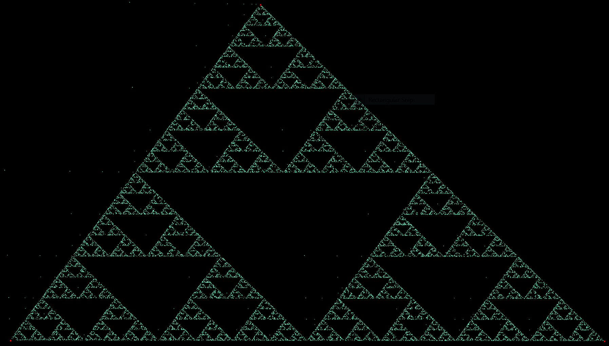
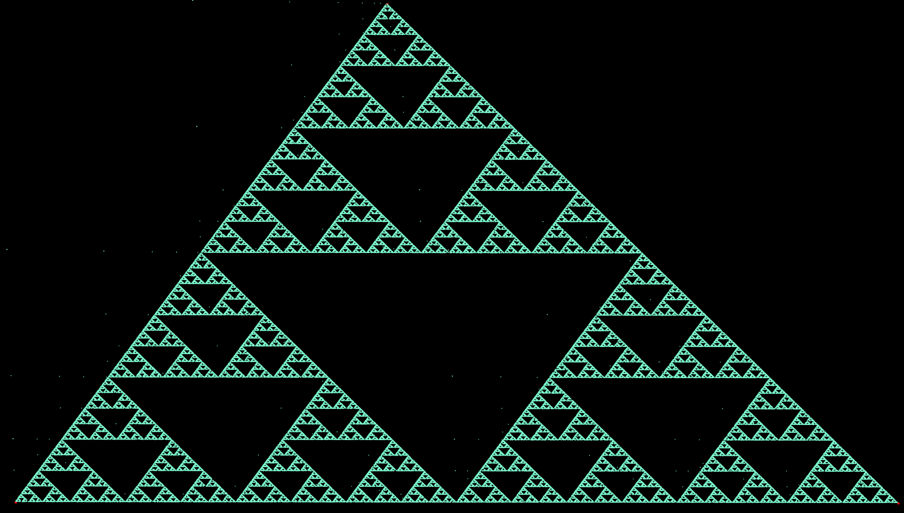
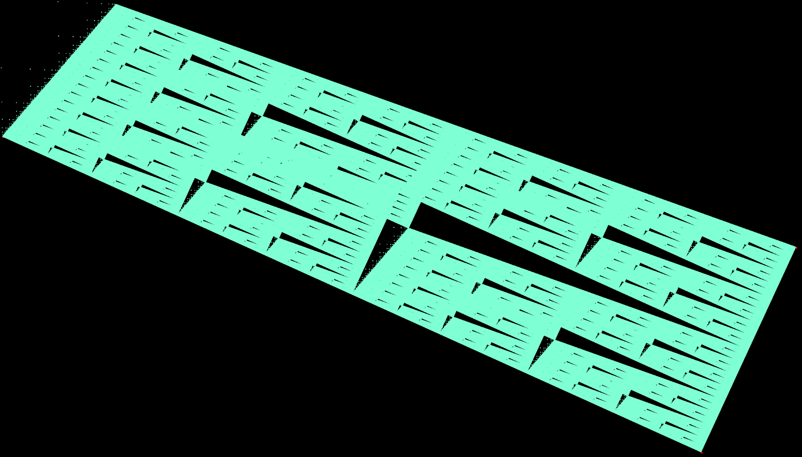

# sstg
SSTG is a Stochatic Sierpinky Triangle Generator

## How to use:
* Select at least three points with the primary mouse button
* Add initial generator points using secondary mouse button or "a" key
* Watch how the Sierpinsky Triangle pattern forms

Press "c" to clear the canvas.

## Screenshots

Triangle being generated:

Triangle after more iterations:

Another possible fractal:

